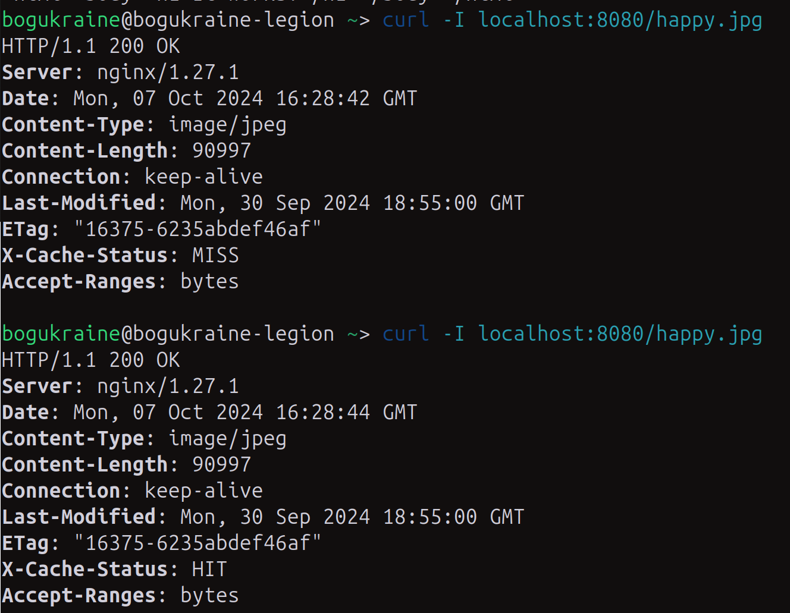

# Homework #14 for Projector course
Your goal is to create your own cdn for delivering millions of images across the globe.  
Set up 7 containers  - bind server, load balancer 1, load balancer 2, node1, node2, node3, node 4. Try to implement different balancing approaches. Implement efficient caching. Write down pros and cons of each approach. 

## Setup
1. `docker compose up`
2. `curl -I localhost:8080` two times

The idea behind that was to make localhost:8080 visible via custom cdn so I would be able to access it from the configuration of rewritten bind server by `curl lb1.test.com...`. But it cannot be implemented without specific restrictions for the system as far as you have to reassign 53 ports. 

So we can try to see if cache works bypassing bind server and addressing requests to localhost:8080 (lb) directly. 

## NGINX Load Balancing Approaches Comparison

| Load Balancing Method | Pros                                                                                              | Cons                                                                                              |
|-----------------------|---------------------------------------------------------------------------------------------------|---------------------------------------------------------------------------------------------------|
| **Round Robin**        | - Simple and easy to configure.                                                                   | - Does not account for server load or health.                                                     |
|                       | - Balances traffic evenly across servers.                                                         | - Can send traffic to slow or overloaded servers.                                                 |
| **Least Connections**  | - Sends traffic to the server with the fewest active connections, improving load distribution.    | - May not account for server performance differences, leading to overloaded but underperforming servers. |
| **IP Hash**            | - Ensures that the same client IP address always reaches the same server, improving session persistence. | - Can lead to uneven traffic distribution if the client IP pool is not uniformly distributed.      |
|                       | - Simple to implement for stateful applications.                                                  | - Limited flexibility, not useful for stateless applications.                                     |
| **Weighted Round Robin** | - Distributes traffic based on server capacity, ideal for servers with different specifications. | - Requires manual tuning of weights, which may need adjustments over time.                        |
|                       | - More efficient than basic Round Robin in heterogeneous environments.                            | - Can lead to inefficiency if weights are not properly configured.                                |
| **Consistent Hashing** | - Ensures the same key (e.g., session ID) reaches the same server, ideal for session affinity.    | - Reconfiguration of servers (adding/removing) can cause cache misses or uneven load.             |
|                       | - Good for caching systems and distributed databases.                                             | - Requires careful design and understanding of the hashing algorithm.                             |
| **Least Time**         | - Routes requests to the server with the least response time and fewest connections.              | - Requires NGINX Plus (commercial version) or third-party modules.                                |
|                       | - Improves responsiveness by considering both connection load and server speed.                   | - May add complexity and overhead in setup.                                                       |
| **Failover (Backup)**  | - Provides high availability by redirecting traffic to a backup server in case of primary failure. | - Backup servers might remain idle, leading to inefficient resource utilization when no failure occurs. |
|                       | - Enhances fault tolerance, critical for production environments.                                 | - Can increase latency when failover occurs.                                                      |
| **Health Check**       | - Ensures traffic is only sent to healthy servers, preventing downtime and improving reliability.  | - May require external or third-party modules (like `nginx_http_upstream_check_module`).           |
|                       | - Essential for production environments with varying server health.                               | - Adds complexity to setup and monitoring.                                                        |
