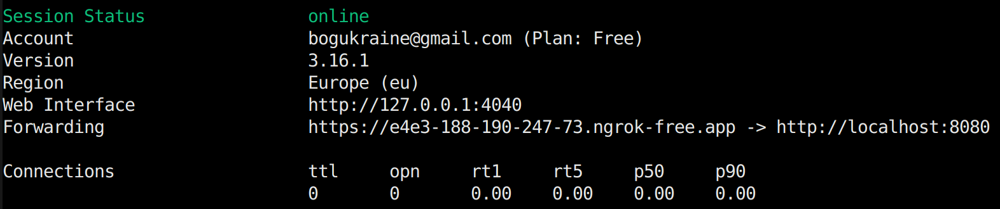
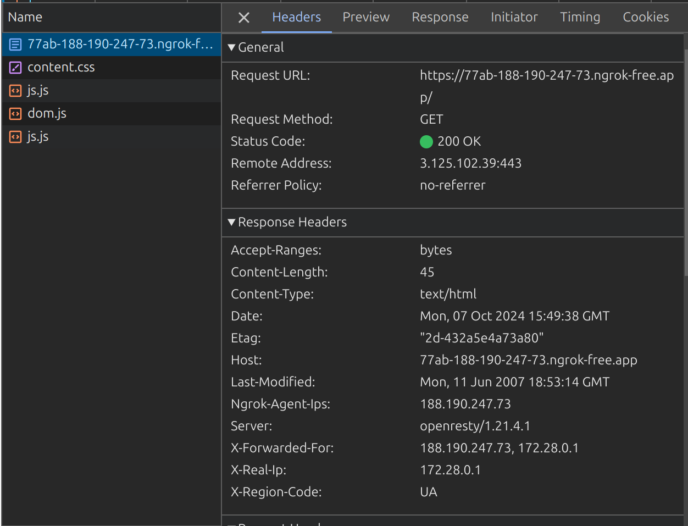

# Homework #14 for Projector course

Set up load balancer on nginx that will have 1 server for UK, 2 servers for US, and 1 server for the rest.  
In case of failure, it should send all traffic to backup server.  
Health check should happen every 5 seconds. 
*Please use ngrok and touch vpn chrome extension. 

## Setup
1. `docker compose up`
2. set ngrok and open tunnel - `ngrok http http://localhost:8080`
3. turn on touch vpn
4. send a request to load balancer switching region - `curl ${ngrok-address}`

## Results

An example of the call w/o VPN:

I was not able to reproduce the redirect to US or GB as far as touch VPN moved me to whatever region it wanted like FL, DE and so on. But it didn't want to produce correct GB or US in `X-Region-Code` custom header that is `$geoip2_data_country_iso_code` in my nginx configuration.
Anyway, it should be working with the setup present in `nginx.conf`. Just need to change VPN
