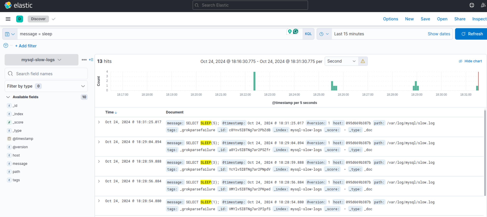

# Homework #15 for Projector course
Set up MySQL with slow query log. 
Configure ELK to work with mysql slow query log. 
Configure GrayLog2 to work with mysql slow query log. 
Set different thresholds for long_query_time (0, 1 , 10) and compare performance. 

## Setup
1. `docker compose up`
2. `sudo chmod -R 755 ./mysql/logs` - give permissions to graylog to read the logs mysql producec in `slow.log` file
3. Create index in Kibana to observe the data according to logstash config - `mysql-slow-logs`

## Testing
1. Init tables and fill in with dummy data - `cat ./mysql/queries/init.sql | docker exec -i mysql mysql -u root -prootpassword`
2. run query for 0 slow query log - `cat ./mysql/queries/long_query_time_1.sql | docker exec -i mysql mysql -u root -prootpassword`
3. run query for 4 slow query log - `cat ./mysql/queries/long_query_time_4.sql | docker exec -i mysql mysql -u root -prootpassword`

The result is visible in Kibana

The last record (on top) shows only 5 second sleep, which is an expected value for 4 `long_query_time`. After that we see the list of sleep 1-5 which is a result of 0 `long_query_time`