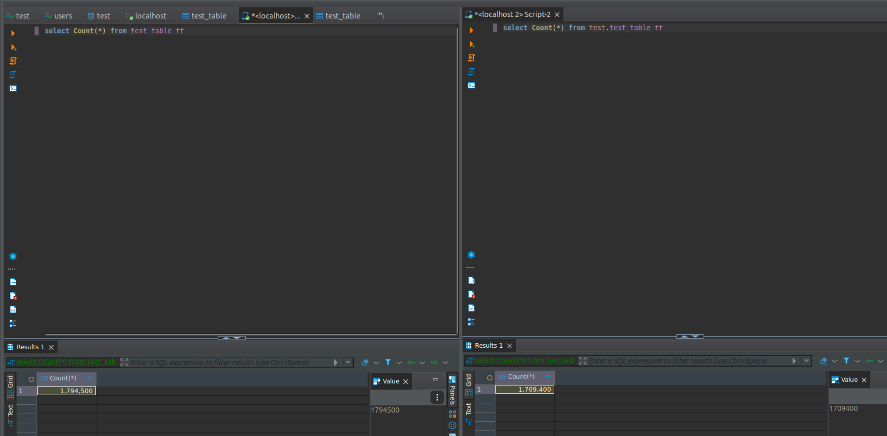

# Homework #19 for Projector course

Create 3 docker containers: mysql-m, mysql-s1, mysql-s2 <br />
Setup master slave replication (Master: mysql-m, Slave: mysql-s1, mysql-s2)<br />
Write script that will frequently write data to database.<br />
Ensure, that replication is working.<br />
Try to turn off mysql-s1 (stop slave).<br />
Try to remove a column in  database on slave node (try to delete last column and column from the middle).<br />
Write conclusion in readme.md<br />

## Setup

1. `npm i`
2. `docker compose up`
3. `npm run db:master:config` - setup master as a master
4. `npm run db:slave1:config` - setup slave1
5. `npm run db:slave2:config` - setup slave2
6. `npm run db:create-table` - create table in master (it will be automatically replicated to slaves)

## Results
Running `npm run insert` will start a script to populate master db with data. It will automatically replicate the data to the slaves.<br />
<br />

We can stop the slave with `npm run db:slave2:stop`. It will not affect the setup and slave1 will be working as it was.<br />
<br />

We can remove the column from the table with `npm run db:slave2:drop-column` command. It was tried to remove the last one and the middle one.<br />
In the first case it didn't affect the flow: slave was able to fetch the data from the master even with a different table structure.<br />
In the second case we received:
```
mysql-s1  | 2024-09-28T13:14:43.332738Z 11 [ERROR] [MY-013146] [Repl] Replica SQL for channel '': Worker 1 failed executing transaction 'ANONYMOUS' at source log mysql-bin.000003, end_log_pos 58780017; Column 2 of table 'test.test_table' cannot be converted from type 'int' to type 'float', Error_code: MY-013146
mysql-s1  | 2024-09-28T13:14:43.333059Z 10 [ERROR] [MY-010586] [Repl] Error running query, replica SQL thread aborted. Fix the problem, and restart the replica SQL thread with "START REPLICA". We stopped at log 'mysql-bin.000003' position 58714499
```
So when the change was applied, the records were not syncing anymore. The proof from DBeaver:


At some point only master was able to insert new records.