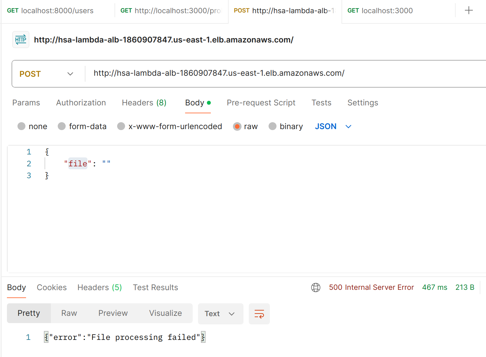

# Homework #23,27 for Projector course
23. Setup CI/CD for your pet project or project based on laradock.
27. Create Lambda function that will convert JPEG to BMP, GIF, PNG.

## Limitations:
It is not the best solution to convert images, but it works with a workaround to use base64. But the example of the way it should work is clear: S3 upload + lambda invocation + S3 file download.

## Results
### CI/CD
There is a workflow file that:
1. Is run on manual trigger not to deploy on every push
2. Runs mock test 1+1=2
3. Builds 2 artifacts: layer and source code and archiving it to `.zip` file
4. Deploys 2 artifacts from the previous step taking secrets from Github secrets. Using retries on upload to AWS.

### Lambda
There was created:
1. lambda - to run the code.
2. ALB - works as API Gateway (trigger) and routes the traffic to lambda.
3. Lambda Layer to store `node_modules`.

setup

error

sent request in postman with base64 jpeg file

decoded image in png

