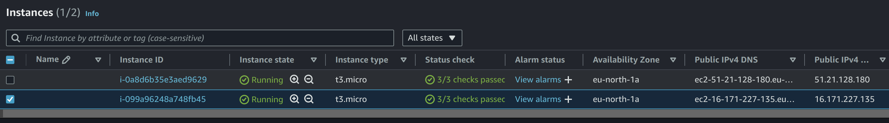
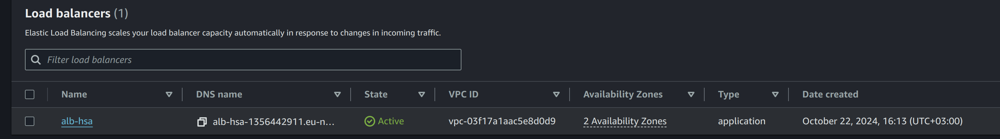
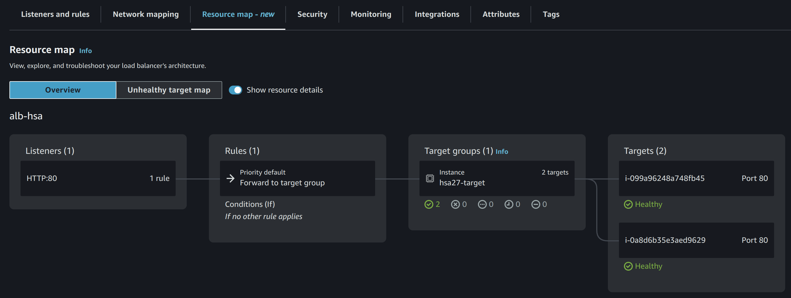
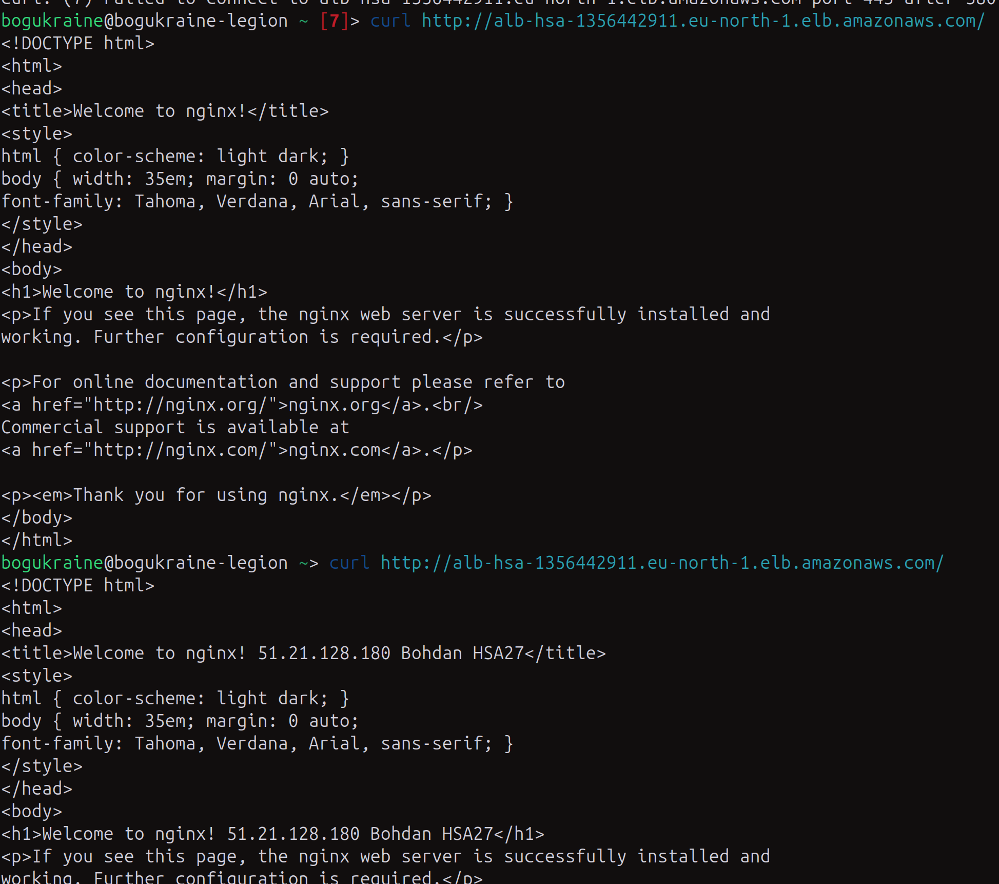

# Homework #24 for Projector course
Create 2 micro instances in AWS.
Setup application load balancer and assign instances to it.

## Setup
I created 2 EC2 instances and ALB. For EC2 nginx was installed, and for one machine html file was changed, when for the second one it was't.

### EC2

### ALB

### Resource map

## Results
Two consecutive requests gave two different results that indicates the requests were routed to the different machines:

