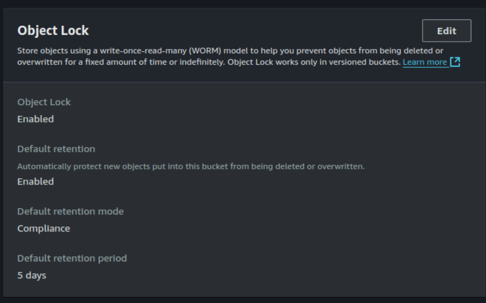
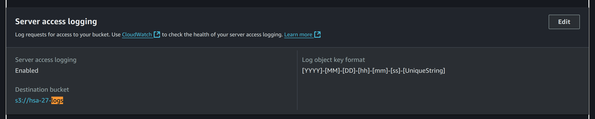
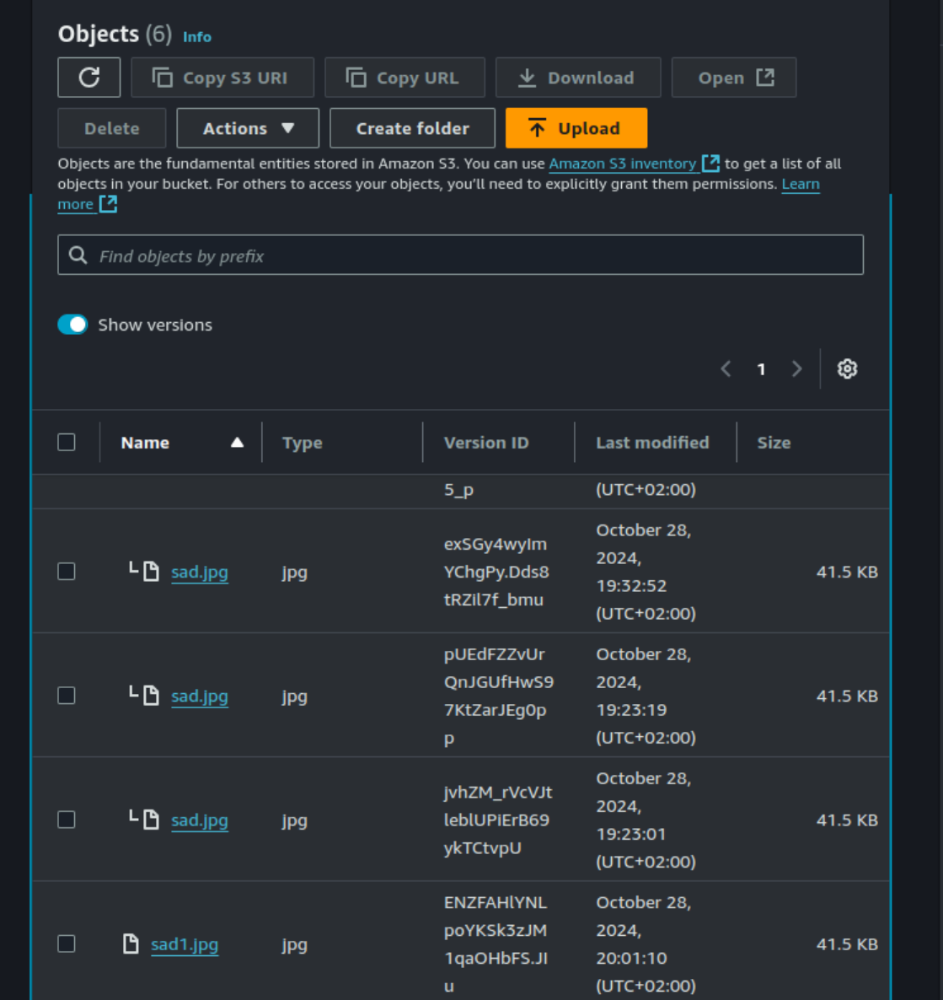
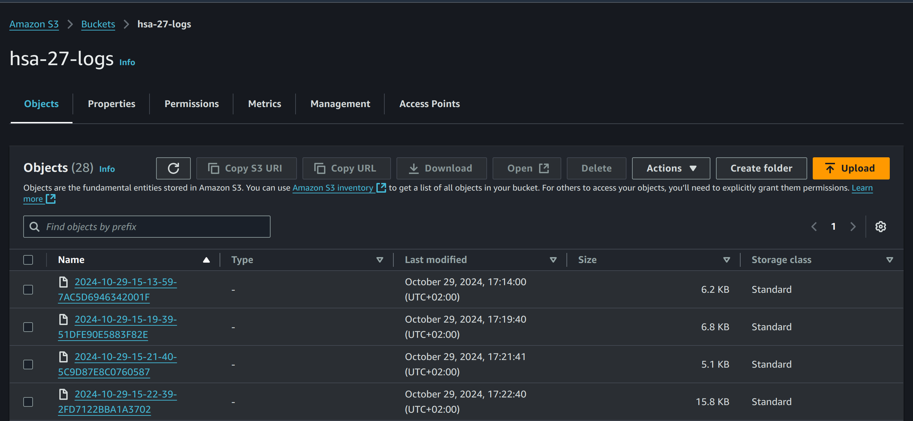

# Homework #25 for Projector course
Create bucket where objects can’t be modified and all requests are logged.

## Setup
There was S3 bucket created with
1. Object lock and retention in Compliance mode 
2. Enabled server access logging for another bucket 
3. When I try to upload an item with the same name, it will create a version istead of replacing the item 
4. Logs example: 